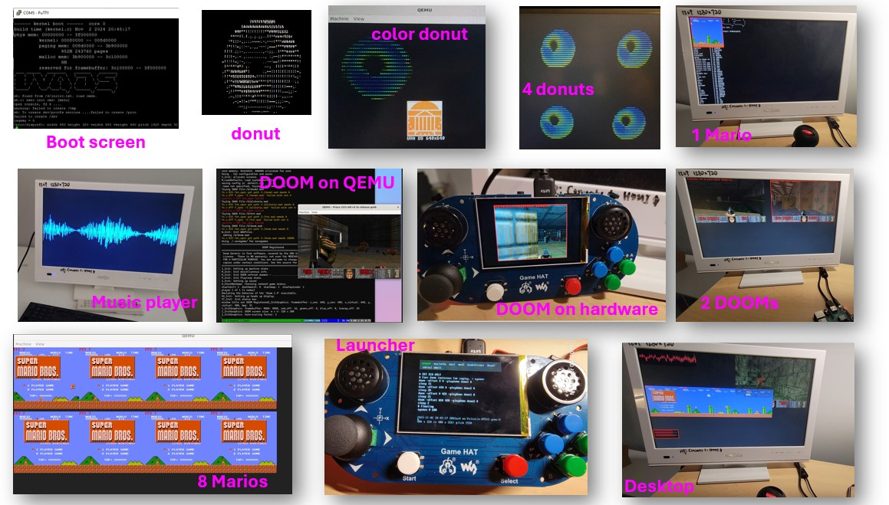
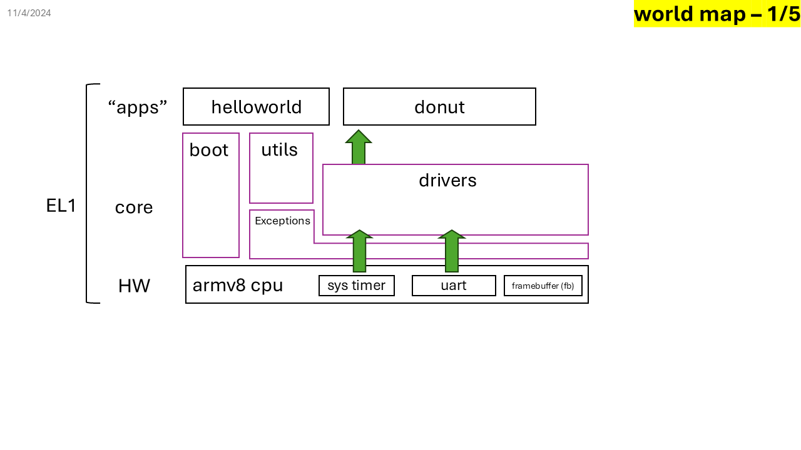
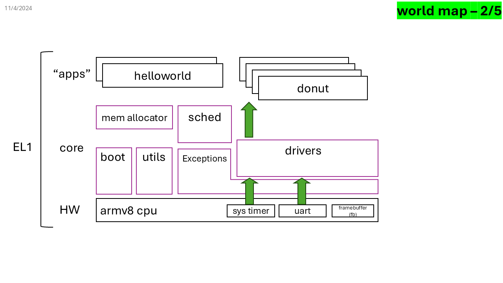
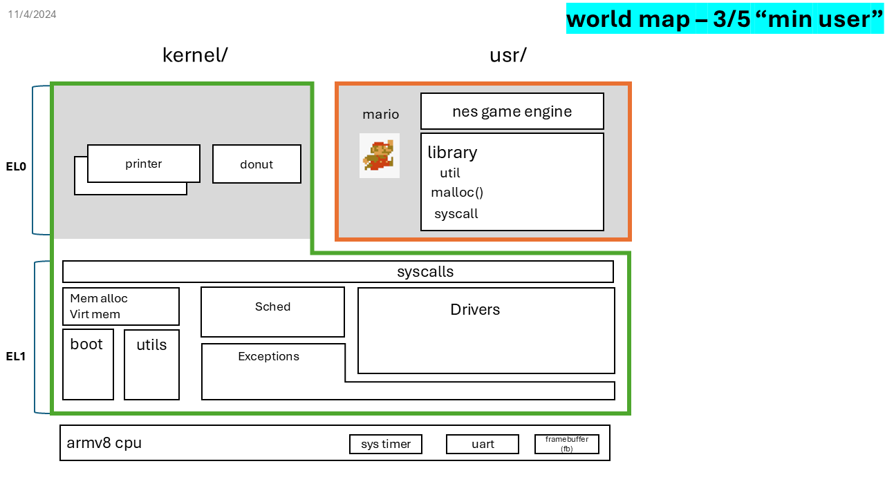
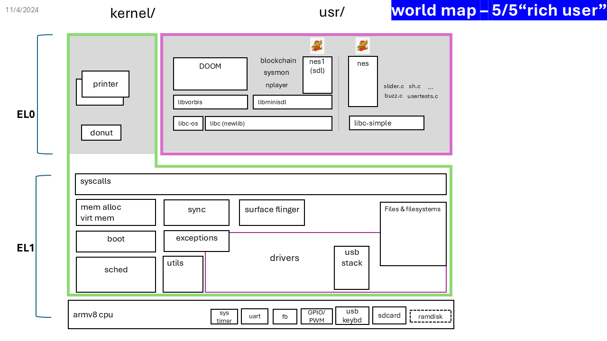

# Operating Systems: From Boot to DOOM

### UVA students: see here for [syllabus for CS4414/6456, Spring 2025](syllabus-25sp.md)

## OVERVIEW

This course is a "guided tour". In one semester, it takes students, who have basic knowledge of the computer software/hardware stack, on the journey of building a modern operating system.

Building an OS can be a tough process, and this course is designed to give students continuous rewards -- both intellectually and emotionally -- just as video games or theme parks do.

This course will start from bare-metal hardware ("boot") and incrementally build more features, enable more applications, and eventually run a full-fledged OS, which can run multiple applications ("DOOM") and on a multicore processor.

## Five worlds

We provide five OS versions: each is functional, but increasingly more "modern". The class assignments (called "quests") will involve completing key features in these OS versions, enabling more applications to run.

**World 1: Baremetal**  
    A single CPU core can boot, print messages from UART, and display pixels. Interrupts work, enabling periodic rendering of a simple "donut" animation. Everything runs in privileged mode (EL1).

**World 2: Embedded**  
    This OS resembles what you would see in an "embedded systems" course. In addition to World 1 features, it can run multiple tasks and preempt their execution. However, everything still runs at EL1.

**World 3: Minimal User**  
    This OS introduces virtual memory and user/kernel separation. It provides syscalls and can run one or multiple "Mario" applications concurrently in userspace.

**World 4: Simple User**  
    The OS now includes file abstraction and file systems. Userspace is built independently of the kernel and executed via `exec()`. The OS implements more I/O drivers, notably USB keyboard and sound device, exposing them via `/proc` and `/dev` to userspace. Userspace comprises a simplified libc and applications including Mario, slider, shell, and a sound tester.

**World 5: Rich User**  
    The OS now boots on multicore (four in rpi3). It includes a FAT32 filesystem and an SD driver, allowing file exchange with PC or Mac. It also includes a "SurfaceFlinger," allowing multiple apps to render on the screen and dispatching input events to the correct app. Userspace is more complete, including a full libc, as well as DOOM (a 3D game), a music player, and a blockchain miner.

World 5 demo (with sound):

https://github.com/user-attachments/assets/6cf05a8e-84f1-4d20-8b01-3e8bcade7cd1

## Emulator or real hardware? 
All the code and quests can run on both the emulator (QEMU) and real hardware (Raspberry Pi 3, or rpi3). 
The emulator simplifies debugging and speeds up iteration, while the rpi3 offers a more authentic OS experience. 

## ACKNOWLEDGEMENT

This course was inspired by and took content from many open-source projects:

- NJU OS course (ProjectN): user/kernel interfaces, rich user apps
- MIT xv6: kernel design
- Circle: bare-metal Raspberry Pi programming
- (and many more)
